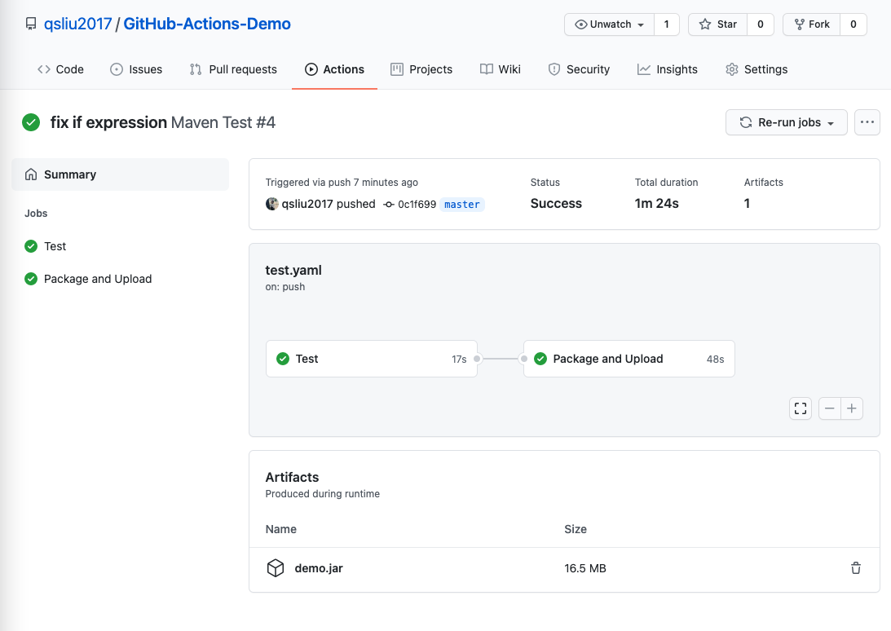

# GitHub Actions 使用和优化

## 入门

GitHub Actions 是一个 CI/CD 工具。

CI/CD 是持续集成/持续部署 (Continuous Integration/Continuous Deployment) 的缩写，是指在开发过程中使用自动化脚本完成生成、测试、部署等。

现代的软件开发更多采用敏捷 (Agile) 过程，简单来说就是通过**少量多次**的迭代实现软件功能，而每一个的迭代周期都包含*需求-设计-开发-测试-构建-部署-运维*的环节。

GitHub Actions 在每一次触发后自动执行预先设定的脚本，完成代码检查、测试、构建和发布等任务，从而加速了软件开发，减少手动操作。

## 使用

下面我们为一个简单的 Spring Boot 项目加入 GitHub Actions 工作流，来了解使用方法。

1. 首先创建一个包含 Spring Boot 项目的[GitHub 仓库](https://github.com/qsliu2017/GitHub-Actions-Demo/commit/e1c70d67a97fe538271ea16a3853d2eb0215bc5a)
1. 在根目录下创建`.github/workflows`文件夹。这个文件夹下的`*.yaml`文件会被 GitHub 识别为一个工作流。
1. 在这里创建一个简单的工作流。

   每一次提交代码后我们都要使用命令`mvn test`运行测试，这个工作可以由 GitHub Actions 来完成。

   创建工作流文件`test.yaml`并输入

   ```yaml
   name: "Maven Test"
       #工作流的名称

   on:
       push:
           branches:
               - master
       # 这个工作流在push到master分支时触发

   jobs:
       test:
           name: Test
           runs-on: ubuntu-latest
               # 在ubuntu-latest环境中运行

           steps:
               - uses: actions/checkout@v2
                   # 把该仓库checkout到运行环境中

               - uses: actions/setup-java@v2
                   with:
                       java-version: "11"
                       distribution: "adopt"
                   # 设置java11环境，附带maven

               - run: mvn test
                   # 执行`mvn test`命令
   ```

1. 保存文件，commit 并[push 到 GitHub 上](https://github.com/qsliu2017/GitHub-Actions-Demo/commit/47c2b5ee62d41c6c9796ae58e65b39405f1d69b8)后，可以在仓库页面的 Actions 页下看到执行结果，之后每次 push 都会执行测试。
   
1. 接下来我们继续完善这个工作流。我们希望在测试通过以后，能够自动构建 jar 包并供下载。

   我们在工作流中增加一个阶段：

   ```yaml
    name: "Maven Test"

    on:
        #...

    jobs:
        test:
            #...

        package:
            name: Package and Upload
            runs-on: ubuntu-latest
            needs: test
                # 等待test阶段完成
            if: ${{ needs.test.result == 'success' }}
                # 如果test通过，则执行package

            steps:
                - uses: actions/checkout@v2

                - uses: actions/setup-java@v2
                    with:
                        java-version: "11"
                        distribution: "adopt"

                - run: mvn package -DskipTests

                - uses: actions/upload-artifact@v2
                    with:
                        name: demo.jar
                        path: target/demo-*.jar
                    # 上传target/demo-*.jar文件，并命名为demo.jar
   ```

1. 同样 push 到 GitHub 上。可以看到 test 运行完成后执行了 package，并且可以下载构建的`demo.jar`。
   
   > 这个工作流只是作为一个添加阶段的例子，并不是一个好的实践，因为`maven`的 package 命令可以在打包前执行测试。
   > 但是对于一些其他的构建工具，比如`node`，这样做是有意义的。

在项目中使用 GitHub Actions 或者其他 CI/CD 工具是有意义的。
我们以[Apache APISIX Dashboard](https://github.com/apache/apisix-dashboard)项目为例来说明。

首先，流水线减少了开发者的机械劳动。一些开发后需要的重复劳动可以被大大减少，比如测试、打包等。Apache APISIX Dashboard 中的大部分流水线都设置为在 PR 时触发，替代代码审查人员完成简单的检查和测试工作。

其次，流水线保证了项目的代码质量。Apache APISIX Dashboard 的流水线中设置了 javascript 和 go 两种语言的 lint，可以帮助缩进、命名等代码规范。对于开源项目来说这点尤为重要。
再比如 Apache 基金会项目中的所有源代码都要遵循规定在文件头加入许可证说明，流水线中也设置了许可证扫描。

GitHub Actions 所有的流水线都以代码的形式保留在项目仓库中，并且可以重用，流水线也应当被视作项目的一部分。

## 优化

随着项目规模增长，流水线任务会变多，完成一次流水线的时间也会变长，这时候就需要优化流水线以提高 CI/CD 的效率。
我在 Summer2021 中的选题是优化 GitHub Actions 的速度，目前 Apache APISIX Dashboard 的流水线运行时间大约在 10 分钟左右，并且即使只修改文档中的一个词都需要完整运行流水线。
下面以上文建立的流水线为例说明我的主要优化方向。

1. 根据变更文件的目录运行任务

   前面提到，如果我们只是修改了文档，那么与代码相关的检查、测试等并没有必要运行。刚刚建立的流水线执行测试和打包，应该只在 src 目录发生变更时运行。于是我们可以这样修改：

   ```yaml
   name: "Maven Test"

   on:
     push:
       branches:
         - master
       paths:
         - src/**
         - pom.xml
         # 只在src下的文件或pom.xml变更时触发

   jobs:
     # ...
   ```

   提交后查看，由于只有`.github/workflows/test.yaml`变更，这个流水线并没有触发。在我的工作中，仅这一项修改，就能使非代码文件修改的流水线缩短至 2-3 分钟。

2. 缓存依赖和构建结果

   在工作流程中包管理器下载依赖的时间通常占用了大部分时间，如果能把这些依赖缓存避免重复下载就可以节省很多时间。我们的示例项目是一个 Maven 项目，Maven 的包保存在`~/.m2`路径下，我们可以用`actions/cahce`来缓存这个目录。

   ```yaml
    # ...
    jobs:
        test:
            name: Test
            runs-on: ubuntu-latest

            steps:
                - uses: actions/checkout@v2

                - uses: actions/setup-java@v2
                    with:
                        java-version: "11"
                        distribution: "adopt"

                - uses: actions/cache@v2
                    with:
                        path: ~/.m2
                        key: ${{ hashFiles('pom.xml') }}
                    # 缓存～/.m2目录，key为pom.xml的hash值

                - run: mvn test
    # ...
   ```

   流水线每次运行时都会用当前`pom.xml`的哈希值保存或查找缓存。也就是说，如果`pom.xml`文件相同，依赖只会在第一次流水线运行时下载。

   其他的包管理器同理，比如`node`项目可以缓存`node_modules`。（最近`actions/setup-node`支持了缓存，在设置 node 环境时就可以选择缓存）

3. 重用流水线结果
   
   在多个流水线中如果有相同的过程，比如两个不同的测试流水线都需要编译项目，那么可以把编译单独作为一支流水线，让测试流水线重用编译结果。

以上三个优化角度对大部分流水线优化都是通用的，而且优化效果也比较明显。
